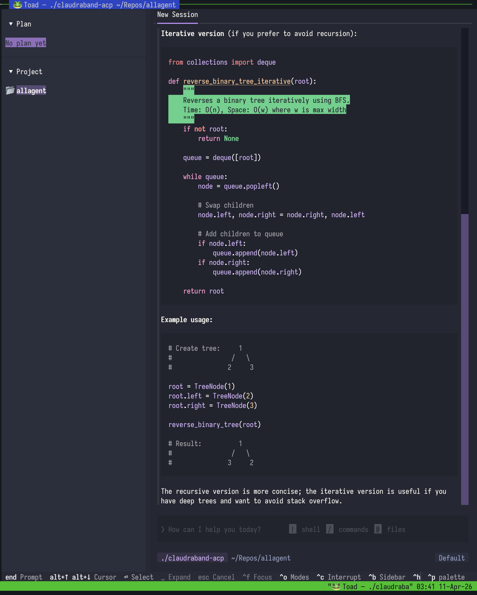
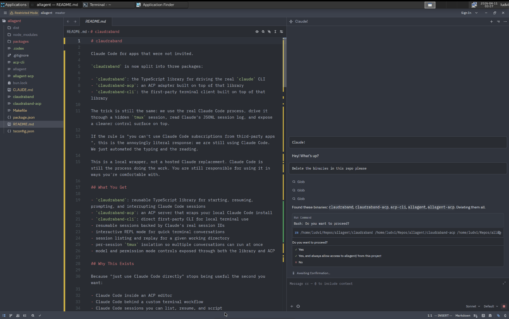

<div align="center">

# claudraband

Control the real local Claude Code CLI from other interfaces by extracting an API out of a terminal.

[What it does](#what-it-does) •
[Getting started](#getting-started) •
[Options][options] •
[Examples](#examples) •
[Session behavior](#session-behavior) •
[Troubleshooting](#troubleshooting)

</div>

## What it does

- Wraps the official local `claude` CLI instead of replacing it
- Drives the real Claude Code TUI through a terminal session
- Exposes that terminal-driven runtime as:
  - a direct CLI
  - an ACP server over stdio
  - a small daemon for persistent headless `xterm` sessions
- Preserves real Claude session IDs so sessions can be resumed later
- Supports `tmux` for detached local sessions and `xterm` for headless PTY-backed sessions
- Lets other tools reuse an already-authenticated Claude Code install without touching auth tokens

> **NOTE**: `claudraband` does NOT intercept OAuth tokens or bypass Claude Code in any shape or form. Anyone you run a single command, claude code is run fully. Persistent sessions with tmux or the xterm daemon mitigate the latency.

## Getting started

### Requirements

- A working authenitcated local `claude` CLI 
- Node.js or Bun
- `tmux` if you want visible persistent detached local sessions

<details>
<summary>Current runtime model</summary>

- `tmux`: best local persistence story, since the Claude Code process stays attached to a live tmux pane
- `direct xterm` runs headless, but only works permission bypass (because this mode has no way to prompt the user)
- `daemon xterm`: keeps `xterm` sessions alive in a daemon so clients can reconnect later, supports everything in the tmux runtime but the sessions are not visible

</details>

### Installation

TODO: fill with npx instructions

### Quick start

```sh
# ask Claude Code something directly
claudraband "audit the last commit and tell me what looks risky"

# interactive REPL
claudraband -i

# list resumable sessions
claudraband sessions

# list local sessions across every cwd
claudraband sessions --global

# close live local sessions across every cwd
claudraband sessions close --global

# close live local sessions for one cwd
claudraband sessions close --cwd /my/project

# resume a session
claudraband -s <session-id> "continue from where we left off"

# answer a deferred prompt in a live session
claudraband -s <session-id> --select 1

# run as an ACP server over stdio
claudraband --acp --claude "--model opus"
# For exmaple if you want to use it toad (https://github.com/batrachianai/toad): 
uvx --from batrachian-toad toad acp 'claudraband --acp -c "--model haiku"'

# start the daemon for persistent headless xterm sessions
claudraband serve --port 7842

# connect to a running daemon
claudraband --server localhost:7842 "hello"

# headless local xterm
claudraband --terminal-backend xterm -c "--dangerously-skip-permissions" "run without tmux"
```

## Options

See [docs/options.md][options] for the command reference, backend behavior, daemon mode, and library surface.

## Examples

Runnable TypeScript examples live in [`examples/`](examples):

- [`examples/code-review.ts`](examples/code-review.ts) — start a session, ask for a code review, and print the result
- [`examples/multi-session.ts`](examples/multi-session.ts) — run multiple Claude sessions in parallel
- [`examples/session-journal.ts`](examples/session-journal.ts) — resume a session and write a simple session journal

### Toad



Using [toad](https://github.com/batrachianai/toad) as the UI while `claudraband` drives the real Claude Code session underneath.

### Self-interrogate


Claude session IDs can be tied to commits and resumed later so the original session can explain why it made a change.

### Zed



Same basic idea, but through ACP inside Zed.

### Direct CLI with shared local tmux session

```sh
claudraband "review the staged diff"
claudraband sessions
claudraband sessions --global
claudraband sessions close --cwd /my/project
claudraband -s <session-id> "keep going"
```

### Daemon-backed xterm sessions

```sh
claudraband serve --port 7842
claudraband --server localhost:7842 "start a refactor plan"
claudraband sessions --server localhost:7842
```

### Headless local xterm

```sh
claudraband --terminal-backend xterm -c "--dangerously-skip-permissions" "run without tmux"
```

## Session behavior

- CLI + `tmux`: sessions stay alive as long as the local tmux-hosted Claude process stays alive
- CLI + local `xterm`: sessions are not truly persistent; resume works by starting `claude --resume <id>`
- CLI + `serve`: the daemon keeps `xterm` sessions alive so you can reconnect and answer deferred prompts later
- ACP + `tmux`: sessions survive ACP disconnect because `claudraband` detaches instead of stopping them
- ACP + local `xterm`: sessions live only as long as the ACP process does

> **Important**: local `xterm` without `tmux` or `serve` requires dangerous Claude permission settings such as `-c "--dangerously-skip-permissions"` or `-c "--permission-mode bypassPermissions"`.

## Packages

- `claudraband-core`: TypeScript runtime for controlling local Claude Code sessions through a real terminal
- `claudraband`: CLI package exposing direct mode, ACP mode, and daemon mode

## Roadmap

- **Session rewinding** -- roll a session back to a specific event or decision point and continue from there, discarding everything after
- **Session forking** -- replay a session up to a chosen point, then branch into a new session with different choices (e.g. "what if Claude had picked the SQL approach instead of the ORM?")

## Troubleshooting

### `xterm` mode exits with a permissions error

Local headless `xterm` mode only works when Claude itself is allowed to proceed without an interactive permission prompt. Use one of:

- `--terminal-backend tmux`
- `--server <host:port>`
- `-c "--dangerously-skip-permissions"`
- `-c "--permission-mode bypassPermissions"`

### Resume works, but an old interactive question is gone

That usually means the original session was not still live. Replaying a session with `claude --resume <id>` restores the conversation history, but not every blocked terminal state. If you need reconnectable pending questions, use `tmux` or the daemon.

### `xterm` under Node complains about `node-pty`

Install the optional `node-pty` dependency or run the CLI through Bun so `Bun.Terminal` can be used instead.

[options]: docs/options.md
