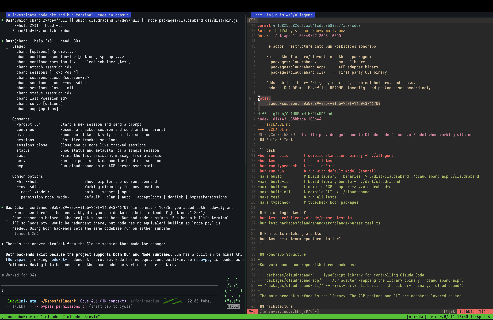
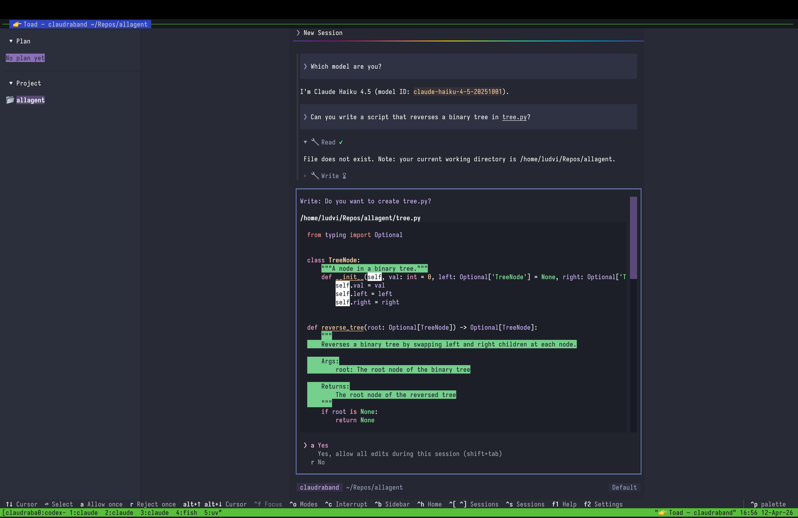
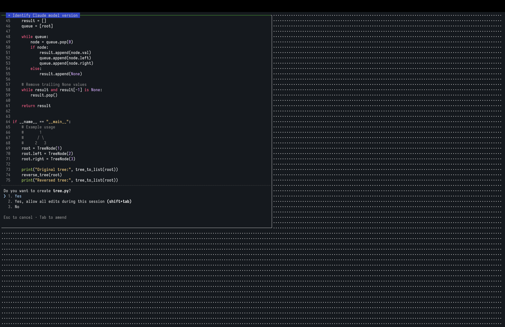
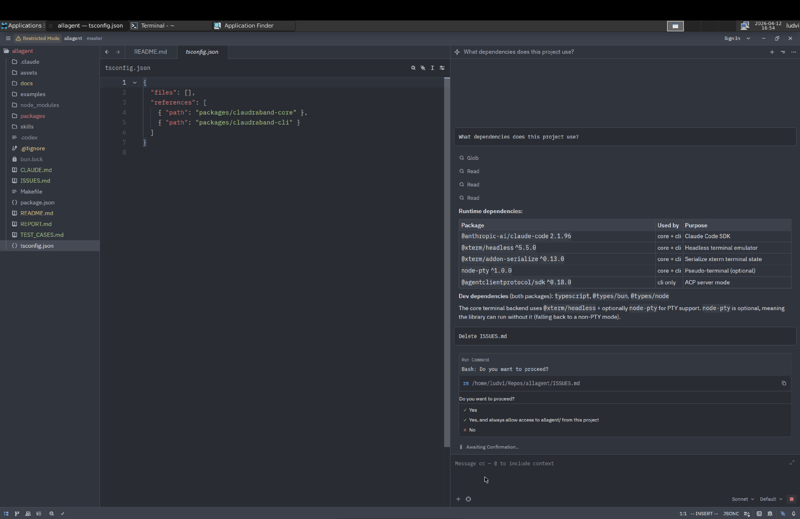

<div align="center">

# claudraband

Claude Code for the power user

> Experimental: this project is still evolving and parts of it may break as Claude Code and ACP clients change.

[Quick start](#quick-start) •
[CLI](docs/cli.md) •
[Library](docs/library.md) •
[Examples](#examples) •
[Troubleshooting](#troubleshooting)

</div>

`claudraband` wraps a Claude Code TUI in a controlled terminal to enable extended workflows. This project provides:

- Resumable non-interactive workflows. Essentially `claude -p` with session support: `cband continue <session-id> 'what was the result of the research?'`
- HTTP server to remotely control a Claude Code session: `cband serve --port 1234`
- ACP server to use with alternative frontends such as Zed or Toad (https://github.com/batrachianai/toad): `cband acp --model haiku`
- TypeScript library so you can integrate these workflows into your own application.

## Caveats

- This is not a replacement for the Claude SDK. It is geared toward personal, ad-hoc usage.
- We do not touch OAuth and we do not bypass the Claude Code TUI. You must authenticate through Claude Code, and every interaction runs through a real Claude Code session.

## Requirements

- Node.js or Bun
- An already authenticated Claude Code
- `tmux` if you want visible persistent local sessions

## Install

```sh
# run without installing globally
npx @halfwhey/claudraband "review the staged diff"

# or install it once
npm install -g @halfwhey/claudraband
```

If you prefer Bun:

```sh
bunx @halfwhey/claudraband "review the staged diff"
```

`claudraband` installs a pinned Claude Code version, `@anthropic-ai/claude-code@2.1.96`, as a dependency for compatibility. It will be bumped over time. If you need to point at a different Claude binary for debugging or compatibility work, set `CLAUDRABAND_CLAUDE_PATH`.


## Quick start

The package installs both `cband` and `claudraband`. The shorter `cband` binary is the recommended CLI. The two first-class ways to use `cband` are:

- local persistent sessions with `tmux`
- headless persistent sessions with `serve`

### Visible persistent sessions with `tmux`

```sh
cband "audit the last commit and tell me what looks risky"

cband sessions

cband continue <session-id> "keep going"

# if Claude is waiting on a choice
cband continue <session-id> --select 2
cband continue <session-id> --select 3 "xyz"
```

### Headless persistent sessions with `serve`

```sh
cband serve --host 127.0.0.1 --port 7842
cband --connect localhost:7842 "start a migration plan"
cband attach <session-id>
cband continue <session-id> --select 2
```

The daemon now defaults to `tmux`, just like the local first-class path. Use `--connect` only when starting a new daemon-backed session. After that, `continue`, `attach`, and `sessions` route through the tracked session automatically.

`--backend xterm` still exists, but it is experimental while we improve it.

### Using the CLI without tmux or server (experimental)

If you run `cband "..."` without `tmux` and without `--connect`, `cband` falls back to a local headless `xterm.js` session. This backend is **experimental** and slower than tmux. It is useful for one-off runs, but it is not a good default for interactive follow-up because the session is not kept alive between commands.

The xterm backend cannot handle Claude Code's initial startup prompts (trust folder, bypass permissions confirmation). You must disable these before using it:

- `-c "--dangerously-skip-permissions"`
- `--permission-mode bypassPermissions`

Without `tmux` or server mode, `cband` shuts down Claude Code after each command finishes and starts it again on the next one. If the last output was a question for the user, that question will not survive well across the next resume. Interactive question flows work best with persistent sessions.

### ACP and editor integration

Use ACP when another tool wants to drive Claude through `claudraband`.

```sh
cband acp --model opus

# for example with toad
uvx --from batrachian-toad toad acp 'cband acp -c "--model haiku"'
```

Some ACP clients still have limitations around resuming existing sessions. `claudraband` itself supports session follow and resume as part of the ACP protocol, but the frontend you put on top may not expose all of that yet.

## Session model

Live sessions are tracked in `~/.claudraband/`.

- `cband sessions` shows only live tracked sessions, either hosted by tmux directly or by the daemon.
- `continue` can resume an existing Claude Code session even when it is no longer live, but `attach` only works on live sessions.
- `sessions close ...` closes live sessions hosted by tmux directly or by the daemon
- `sessions close --all` will close all live sessions controlled by Claudraband

## Examples

### Self-interrogation

I have a Claude Code hook that saves the session id that was involved in a commit so I can ask it questions about the commit later. In this workflow, Claude can use `claudraband` to interrogate that older session and justify the choices it made.



### Toad via ACP

Toad can use `claudraband acp` to be an alternative frontend for Claude Code.



That UI is backed by a real Claude Code pane underneath.



### Zed via ACP

Zed can also use `claudraband acp` to be an alternative frontend.



## Library use

Runnable TypeScript examples live in [`examples/`](examples):

- [`examples/code-review.ts`](examples/code-review.ts) starts a session, asks for a review, and prints the result
- [`examples/multi-session.ts`](examples/multi-session.ts) runs multiple Claude sessions in parallel
- [`examples/session-journal.ts`](examples/session-journal.ts) resumes a session and writes a simple journal

For the full TypeScript API, see [docs/library.md](docs/library.md).
